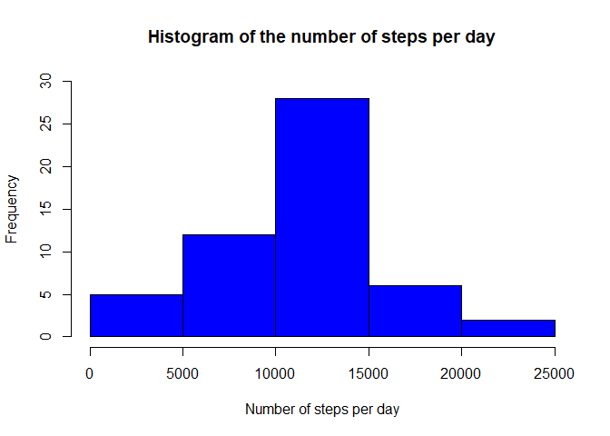
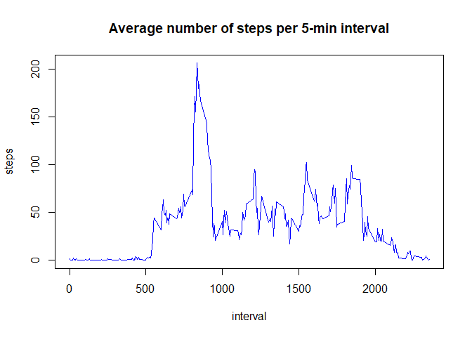
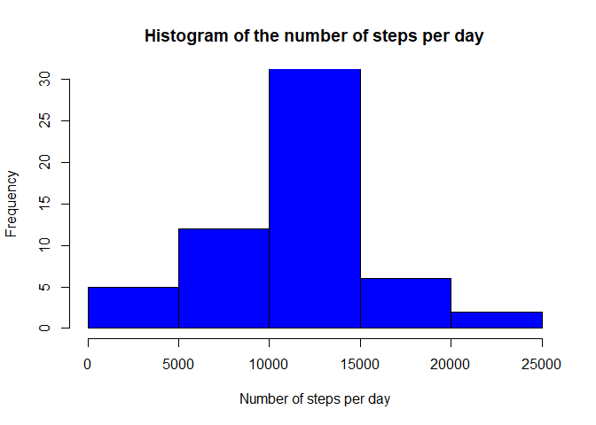
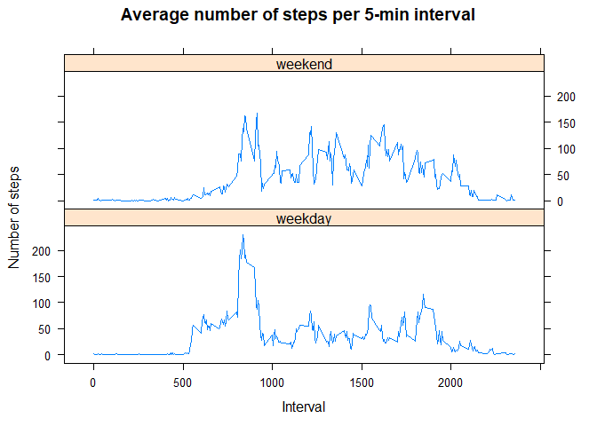

## Loading and preprocessing the data

```r
datasteps <- read.csv("./data/activity.csv", header = TRUE, na.strings = "NA")
datasteps$date <- as.Date(datasteps$date, "%Y-%m-%d")
```


## What is mean total number of steps taken per day?

```r
datapresent <- datasteps[!is.na(datasteps$steps),]
stepsdate <- aggregate(steps~date, data = datapresent, sum)
hist(stepsdate$steps, ylim = c(0,30), col = "blue", 
     xlab = "Number of steps per day", 
     main = "Histogram of the number of steps per day")
```

<!-- -->

```r
print("Mean =")
```

```
## [1] "Mean ="
```

```r
mean(stepsdate$steps)
```

```
## [1] 10766.19
```

```r
print("Median =")
```

```
## [1] "Median ="
```

```r
median(stepsdate$steps)
```

```
## [1] 10765
```


## What is the average daily activity pattern?

```r
averagedaily <- aggregate(steps~interval, data = datapresent, mean)
with(averagedaily, plot(interval, steps, type = "l", col = "blue", main = "Average number of steps per 5-min interval"))
```

<!-- -->

```r
print("5-min interval with the maximum number of steps:")
```

```
## [1] "5-min interval with the maximum number of steps:"
```

```r
averagedaily[which(averagedaily$steps==max(averagedaily$steps)),1]
```

```
## [1] 835
```


## Imputing missing values (mean for that 5-minute interval)

```r
print("Number of missing values:")
```

```
## [1] "Number of missing values:"
```

```r
sum(is.na(datasteps$steps))
```

```
## [1] 2304
```

```r
datafilled <- datasteps
for (i in 1:nrow(datafilled)){
        if (is.na(datafilled$steps[i])){
                datafilled$steps[i] <- averagedaily[which(averagedaily$interval==datafilled$interval[i]),2]
        }
}
stepsdatefilled <- aggregate(steps~date, data = datafilled, sum)
hist(stepsdatefilled$steps, ylim = c(0,30), col = "blue", 
     xlab = "Number of steps per day", 
     main = "Histogram of the number of steps per day")
```

<!-- -->

```r
print("Mean =")
```

```
## [1] "Mean ="
```

```r
mean(stepsdatefilled$steps)
```

```
## [1] 10766.19
```

```r
print("Median =")
```

```
## [1] "Median ="
```

```r
median(stepsdatefilled$steps)        
```

```
## [1] 10766.19
```

```r
print("The results didn't change much, because whole days were missing, and the values imputted were the average")
```

```
## [1] "The results didn't change much, because whole days were missing, and the values imputted were the average"
```


## Are there differences in activity patterns between weekdays and weekends?

```r
datafilled$weekday <- strftime(datafilled$date, "%u")
datafilled$weeklevel <- ifelse(datafilled$weekday %in% as.character(c(1:5)), "weekday", "weekend")
datafilled$weeklevel <- as.factor(datafilled$weeklevel)
dataweeklevel <- aggregate(steps~interval+weeklevel, data = datafilled, mean)

library(lattice)
xyplot(steps ~ interval | weeklevel, dataweeklevel, type = "l", layout = c(1, 2), main = "Average number of steps per 5-min interval", xlab = "Interval", ylab = "Number of steps")
```

<!-- -->
